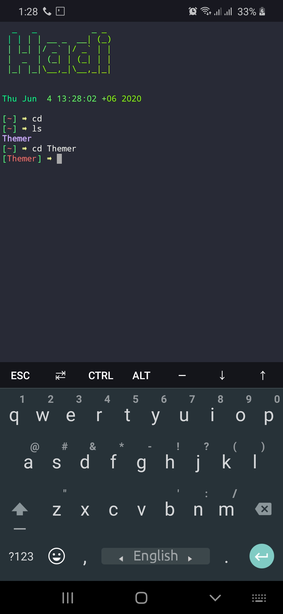

    

      Make Termux Beautiful

  
  

 

  
 

 

### Introduction

*Themer is a Dracula color properties and bashrc banner for Termux .*
Themer was developed for Termux only.

 

------------------------------------------------------------------------

### How to Install

Open the terminal and type following commands.

* `apt update`

* `apt install git`

* `git clone https://github.com/hadiislam/Themer.git`

* `cd Themer`

* `chmod +x *`

* `sh setup.sh`

------------------------------------------------------------------------

### How to Use ?

After run the script..

- Write your name

- Restart Termux

------------------------------------------------------------------------

### Uninstall

To uninstall Themer

* `sh remove.sh`

